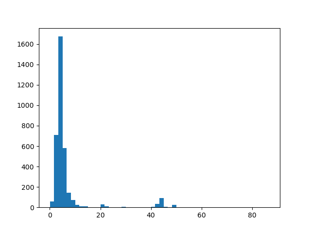

# hw-chinook

Exercises using the [chinook database](https://github.com/lerocha/chinook-database)

* [Chinook ER diagram](https://observablehq.com/@pbogden/chinook-er-diagram) -- reference notebook
* [chinook database repo](https://github.com/lerocha/chinook-database/) -- github

## Entity-Relationship Diagrams

* PRAGMA statements were used to create this Entity-Relation Diagram...
  * [Entity Relation Diagram](https://observablehq.com/d/2edf02959e5d03fe) -- observable notebook
  * [GraphViz](https://www.graphviz.org/) -- graphviz.org
  * open source software for graph visualization
  * [GraphViz theory](https://graphviz.org/theory/) -- graphviz.org
  * [Reactive, Reproducible, Collaborative: Computational Notebooks Evolve](nature_article.pdf) (2021) Nature
* An E-R model is usually the result of systematic analysis to define and organize data needed in an area of a business.
  * Typically, it represents records of entities and events monitored and directed by business processes,
  rather than the processes themselves.
  * It is usually drawn in a graphical form as boxes (entities) that are connected by lines (relationships)
  that encode the associations and dependencies.
  * Ref: [ER diagram](https://en.wikipedia.org/wiki/Entity%E2%80%93relationship_model) -- wikipedia
  * Each row of a table represents on instance of an entity type
  * Each field in a table represents an attribute type
  * Entity relationships are implemented with primary key and foreign keys.
  * The primary key of one entity is a pointer or foreign key to the table of another entity

# Setup

* Create the chinook database from the SQL commands
* Download the text file with SQL commands and use them to create a database.

```
make data/chinook.db
```

### Example: histogram

* Create a histogram of track length (minutes) for all the tracks. 
* Use a bin width of 100 seconds.

The following command...
```
make hist
```
Produces this graph...



Compare with [sql-chart](https://observablehq.com/@observablehq/sql-chart) -- observable notebook

Note: the min and max duration...
```
min duration: 0.02 minutes
max duration: 88.12 minutes
```

# EXERCISES

Answer the questions in each of the groups. 


Put your solutions to each question in the related markdown file and include the SQL that you used: Solutions Added.

* [group 1](group1.md)
* [group 2](group2.md)
* [group 3](group3.md)
